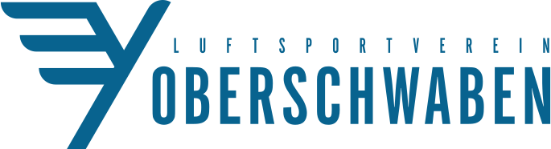

# segelfliegen.com (Rheinermark)

This is a software project that is created in the context of the aero club *Luftsportverein Ruhr-Lenne Iserlohn e.V.* in Germany. Therefore, the rest of this README is in german, but you can ask any question in case that further assistance is needed.

## Vision

Dieses Projekt wurde aus der Idee heraus geboren, ein Software-System für Luftsportvereine zu enwickeln, welches nicht nur als Homepage fungiert, sondern auch self-service Funktionen für Mitglieder, Informationsmanagement und auch die Erfassung von Startlisten aus einem Guß zu bieten.

Das Softwareprojekt ist derzeit noch sehr jung und wird exklusiv für die *Luftsportvereinigung Ruhr-Lenne Iserlohn e.V.* entwickelt und an deren Belange und Interessen angepasst. Es soll jedoch ganz im Zeichen der Freien Software transparent und für jeden Einsehbar sein, und Jeder der möchte kann mitwirken.

Wir würden uns natürlich auch sehr freuen, wenn andere Luftsportvereine sich den Einsatz dieser Software vorstellen könnten und daran mitentwickeln, und wir am Ende eine freie, unabhängige und ein vom Luftsport für den Luftsport entwickeltes, maßgeschneidertes, freies System erhalten würden, das keine Wünsche mehr offen lässt.

Das ist natürlich erstmal nur eine Vision, aber die Möglichkeiten sind da.

## Todos und Ideensammlung

- [x] Webseite mit individuellen Inhalten (z.T. statisch)
- [x] Mitglieder-Bereich mit Login
- [x] Flugzeugdatenbank
- [x] Dokumentenverwaltung
- [x] Link-Sammlung
- [x] Mitteilungen an den Vorstand
- [ ] Newsletter
- [ ] Kalender
- [ ] Flugdaten-Schnellerfassung ([airbatch](https://github.com/phorward/airbatch) Demo)
- [ ] Kantine
- [ ] Dienstemanagement
- [ ] Checklisten
- [ ] Fotodatenbank
- [ ] Flugzeugreservierung
- [ ] Online-Flugbuch
- [ ] Gastflug-Gutscheine

## Technische Details 

Dieses Sofware-System wurde mit dem Framework [ViUR](https://viur.is) erstellt, und ist in Python geschrieben.

### Building the Vi

To build the administration backend Vi, run

```bash
$ cd vi
$ make deploy
```

## Install prerequisites

To install prerequisites, once run

```bash
$ pip2 install -t deploy/lib -r requirements.txt --upgrade
```

or on any prerequisite change/update.

## Run local development version

To locally run, do

```bash
$ ./local_run.sh
```

## Deploy to GAE

Deployment is performed using the gcloud SDK:

```bash
$ cd deploy

# Deploy to dev
$ gcloud app deploy --no-promote -q --project=rheinermark-viur --version=$USER-dev

# Deploy to live (beware!)
$ gcloud app deploy -q --project=rheinermark-viur --version=`date +"%Y-%m-%d"-$USER`
```
